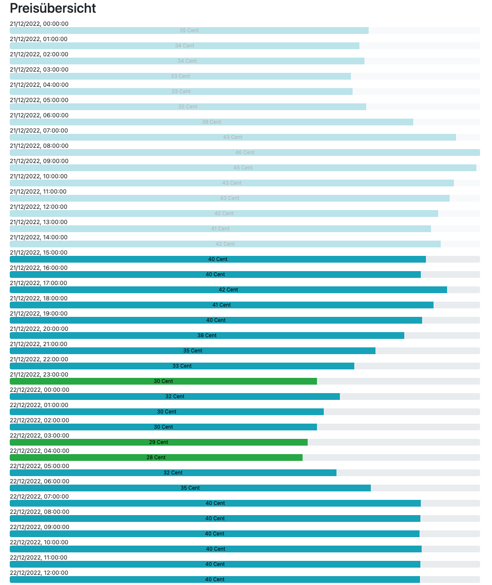
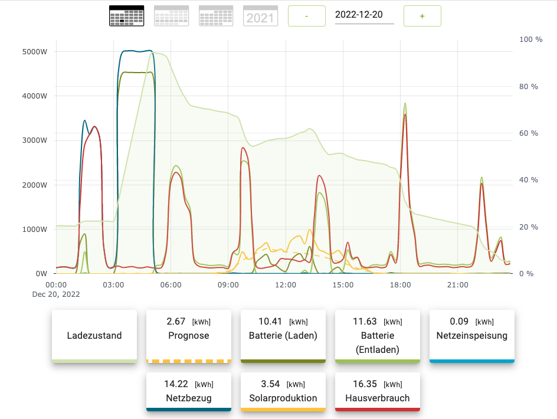

# e3dc grid charge

## What is this about?

This will get prices from the tibber api, find out the cheapest hours and charge an E3 DC battey storage system via
e3dc rscp protocol mainly based on https://github.com/git-kick/ioBroker.e3dc-rscp

The idea is to use energy when it is cheaply available and not beeing needed by most people on the energy grid.
As prices on the epex spot market are released at about 13:00 this software will ask for the day ahead prices at about 14:00 and search for the x cheapest hours for the next 24 hours.
The prices and the selected hours can be viewed with a webserver on port 8080 -> http://localhost:8080/

It is important to note that charging the battery and discharging it will wear it down. So to take this into account we can calculate how much storing of 1 kwh costs. For example if my E3DC Setup cost 10k Euro and I got 10 kwh capacity available. If we presume that we would need to replace the battery after 10000 cycles one kwh will cost us: 10,000 Euro / 10,000 / 10 = 0,10 Euro. Surely we're doing this because we got the battery anyway to use our solar power from the summer. So it is pretty hard to do a perfect calculation for this.
The parameter for that "battery_degredation_cost" is currently not implemented and not used.

Be careful with this, this is a very early version. If you plan to use this be sure you know what you are doing.

Web interface showing one day in december 2022


Typical day where grid charging has been active for 2 hours in the night


If you want to get in touch with me, just message me on Telegram:
[@Master92](https://t.me/Master92) 🇩🇪🇬🇧

### Where to get your tibber token?
* https://developer.tibber.com/
### Where to get your tibber home id?
* https://developer.tibber.com/explorer
use the following request parameters to get all home id's and the according addresses
```
{
  viewer {
    homes {
      id
      address {
        address1
        postalCode
        city
      }
    }
  }
}
```
### Where to set the rscp password?
* on your E3DC touch panel under personalize > user profile > scroll down


## Setup
* clone repo
* ```cd e3dc_grid_charge```
* ```sudo apt-get install npm```
* ```npm install```
* ```cp config.example.json config.json```
* ```nano config.json``` (change config to fit your needs)


## Start Server
* ```node index.js```

## How to run on a server
It is a good idea to use this script on a raspberry pi, to run it you could use pm2:
* ```sudo npm install pm2 --global```
* ```pm2 startup``` (to autostart pm2 on boot)
* ```pm2 start index.js```
* ```pm2 save``` (to save that the line above should always be started on startup)
* view logs with ```pm2 log```

## Found a bug/need a feature?
Please use the Issue tracker on github